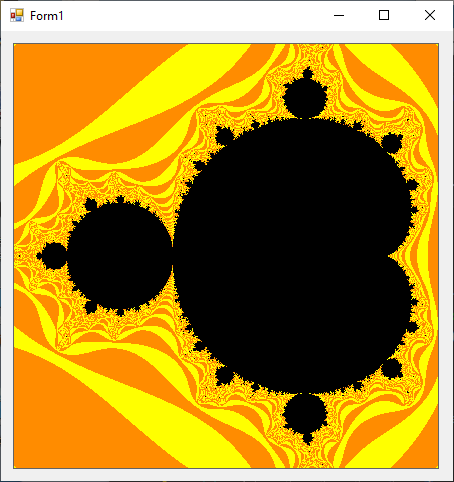

# WindowsFormsMandelbrot

 Basic fractal drawing on WinForms. Draws the Mandelbrot fractal on a windows form project, using a picture box to display the geneated image. Uses direct memory access to bitmap bytes using `.LockBits()` in order to speed up image generation. Image recalculated on resize.

